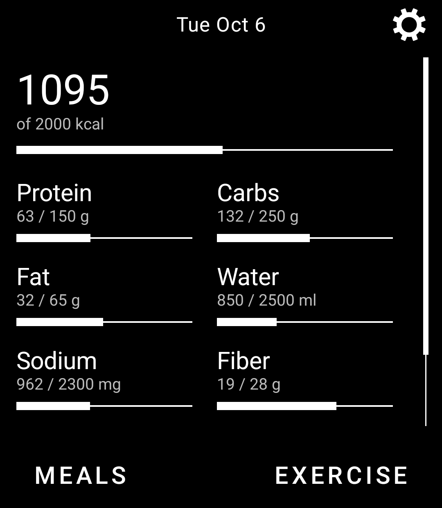
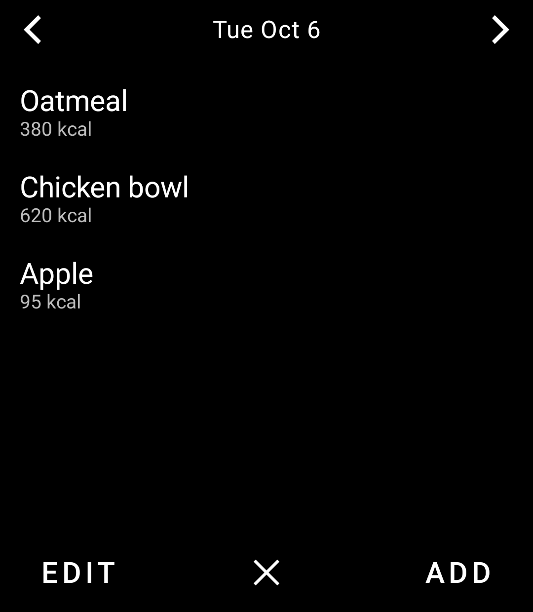
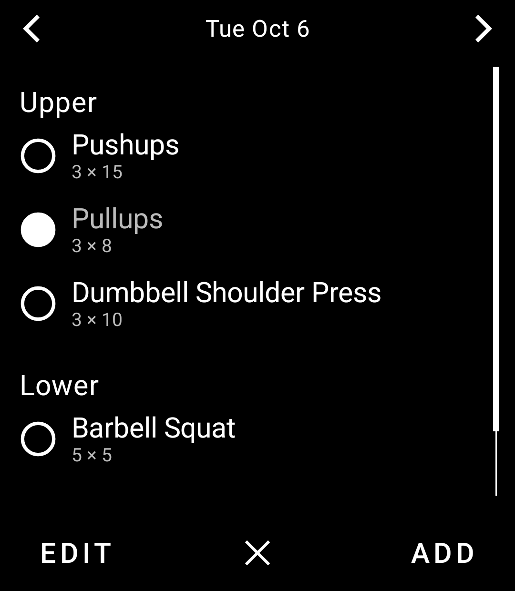
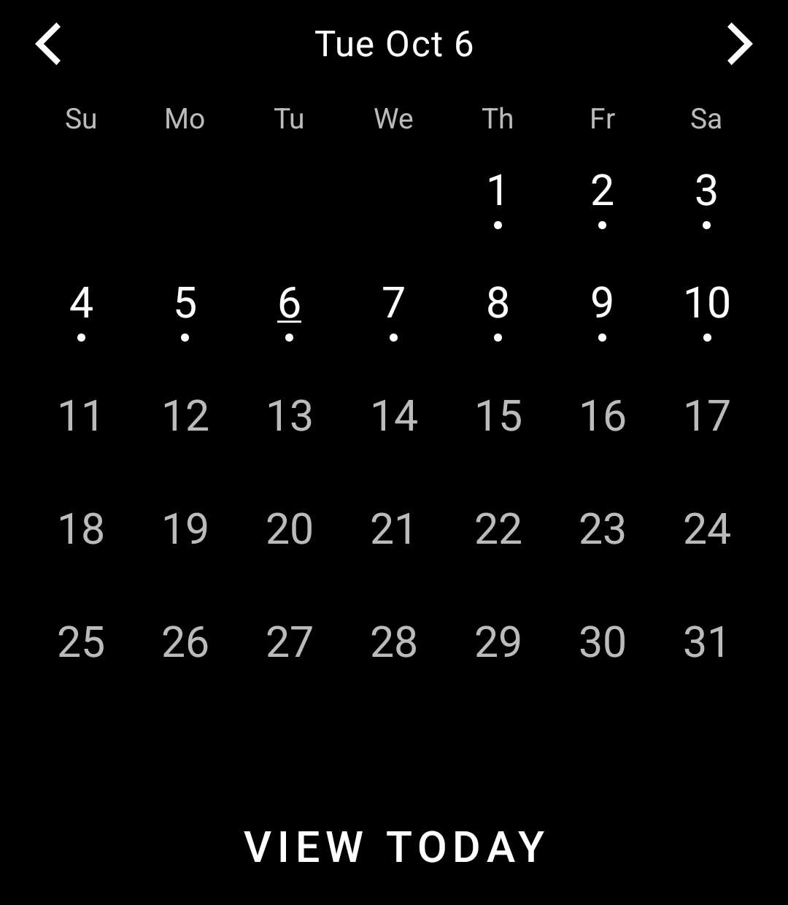
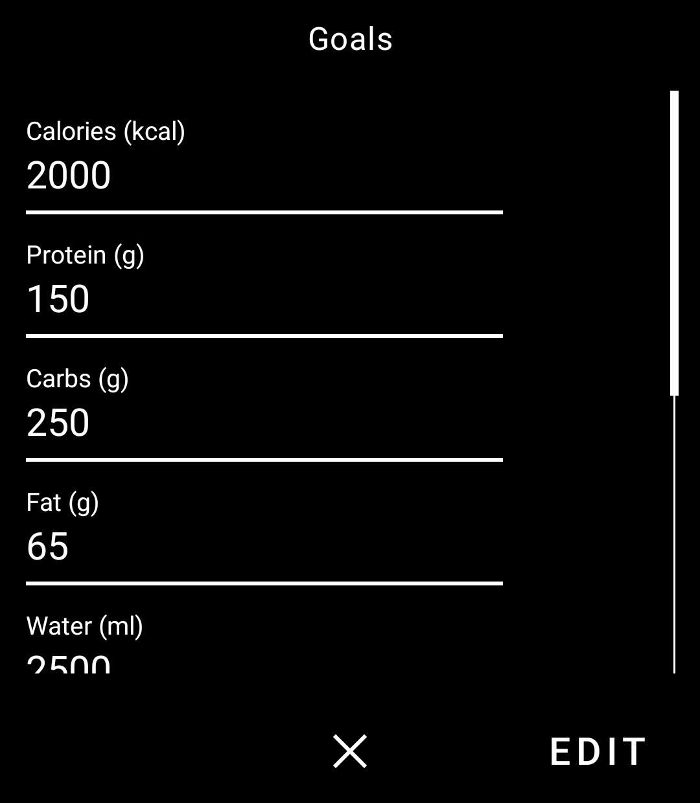

# Lifestyle

Lifestyle for the [Light Phone III](https://www.thelightphone.com/). Log meals and macros, and check off the exercises you planned for each day.

This repository is a Light SDK tool. The app lives in [`tool/`](./tool); package id `com.thelightphone.lifestyle`.

<p>
  
  
  
</p>
<p>
  
  
</p>

## What you can do

**Home.** The title is the date (`Tue Oct 6`). Calories sit on a progress bar. Protein, carbs, fat, water, sodium, fiber, sugar, and potassium are a two-column grid underneath. **MEALS** and **EXERCISE** open that day. The gear opens goals.

**Meals.** Chevrons move one day. The list is that day's meals. **ADD** opens saved meals; tap one to log it, or **NEW** to start from scratch. On the meal form, **SAVE** keeps it for later and **ONCE** adds it only to the selected day. **EDIT** is how you delete a logged meal.

**Exercise.** Same day controls. Each weekday can have several groups, and each exercise is one sets × reps line. Tap an exercise to check it off for that date. The next week starts unchecked. **ADD** creates a group. **EDIT** is how you rename a group, change sets and reps, or delete a group or exercise. Deletes ask you to confirm.

**Calendar.** Tap the date to open the month. The week starts on Sunday. A dot means that day has a logged meal or a completed exercise. **VIEW TODAY** jumps back to the current day. Chevrons move a month while the calendar is open, and a day when it is closed.

**Goals.** Each nutrient has a daily target. **EDIT** shows a toggle beside every nutrient except calories, which always stays on the home screen. Hiding a nutrient only removes it from home. It stays on the meal form, and a hidden row uses the same faded type as a finished exercise.

## Exercise list

Search covers a bundled catalog and exercises you create. Yours are stored with source `user` and appear in the same list.

The catalog is a thinned copy of [free-exercise-db](https://github.com/yuhonas/free-exercise-db) (Unlicense). Images, level, and instructions are not included.

## Run it

You can sideload the APK onto a Light Phone III, or run it on an Android emulator that looks like an LP3:

- 1080 × 1240, 3.92" display
- Android API 34
- No Google Play

```bash
./gradlew :tool:installDebug
adb shell am start -n com.thelightphone.lifestyle/com.thelightphone.sdk.LightActivity
```

For LightOS-as-a-system-app (toolbox, theme, the way a real phone launches tools), follow [Using the LightOS Emulator](docs/system_app). The tool’s `serverPackage` in [`tool/lighttool.toml`](tool/lighttool.toml) is set to `com.thelightphone.sdk.emulator` for that setup; switch it to `com.lightos` for hardware.

Open the repo in Android Studio (or IntelliJ) and run the `:tool` configuration if you prefer a GUI.

The UI is Compose on top of the SDK’s `LightScreen` / `LightViewModel` pair, using `LightTopBar`, `LightBottomBar`, `LightScrollView`, `LightText`, and `LightIcons`. Meals, goals, and workouts are a JSON file in the app’s files directory.

## Layout

| Path | What it is |
| --- | --- |
| [`tool/src/main/kotlin/com/thelightphone/lifestyle/`](tool/src/main/kotlin/com/thelightphone/lifestyle/) | Screens, meals, workouts, and storage |
| [`tool/src/main/assets/exercises.json`](tool/src/main/assets/exercises.json) | Bundled exercise catalog |
| [`sdk/`](sdk/) | Light SDK (client, UI, emulator) |
| [`docs/`](docs/) | SDK docs, including the emulator walkthrough |

This tree still includes the upstream Light SDK so the tool can build and run against it. Lifestyle-specific code is the `tool` module.
